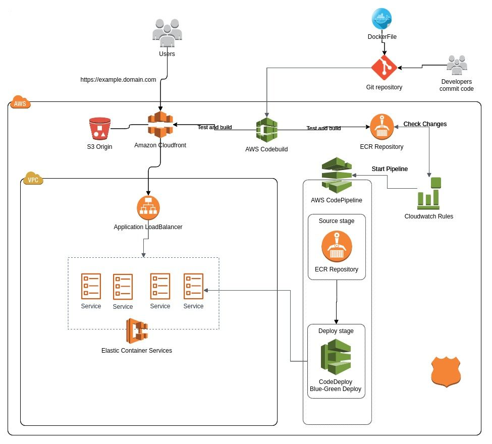

# pipeline-git-ecs-codedeploy

Este repositório contém um projeto escrito em Terraform para criação de uma solução completa de hospedagem de uma aplicação de frontend, serviços/tasks no ECS e pipeline de entrega contínua utilizando o GITHub como source, Codebuild e Codedeploy.

Com a solução, ao ser executado um push na branch 'master' do repositório origem do GitHub, o webhook envia ao Codebuild um aviso de que houve alteração. O Codebuild, por sua vez, inicia o processo de geração da imagem e upload no repositório do ECR. O repositório é monitorado pelo Cloudwatch, que quando identifica atualização da imagem, inicia o Pipeline de deploy. 
O Codedeploy executa o deploy utilizando o tipo Blue/Green deployment, que consiste em iniciar novas tasks com a imagem nova e rotear o tráfego do LoadBalancer para elas, quando o processo é concluído, as tasks antigas são finalizadas.

Serviços utilizados:
* AWS Cloudfront
* AWS CloudWatch
* AWS CodeBuild
* AWS CodeCommit
* AWS CodeDeploy
* AWS CodePipeline
* AWS Elastic Container Service
* AWS Elastic Container Registry
* AWS ElasticLoadbalacer
* AWS Route53
* AWS S3
* AWS VPC
* GitHub



Estrutura de Arquivos:

* buckets - arquivos para criação dos buckets utilizados no projeto;
* environment - arquivos para criação da estrutura proposta;
* modules - módulos de apoio para criação da estrutura (reutilizáveis);
* templates - templates de policies e configurações utilizados;
* vpc - arquivos para criação da VPC utilizada no projeto;


# Criação da estrutura

**Observação**: A configuração do remote-state backend não aceita variáveis, portanto deve sempre ser verificada no arquivo 'main.tf' e atualizada se necessário.

1. VPC (vpc)
  * Alterar as variáveis no arquivo 'variables.auto.tfvars';
  * Executar os comandos:
    ```bash
    $ terraform init
    $ terraform plan
    $ terraform apply --auto-approve


2. Buckets e table Lock (buckets)
  * Criar primeiro o bucket do remote state (buckets/remote-state), que será utilizado para armazenar os arquivos de state do terraform;
  * Criar os buckets do Codebuild e do Codepipeline;
  * Alterar as variáveis no arquivo 'main.tf' de acordo com a necessidade;
  * Executar os comandos:
    ```bash
    $ terraform init
    $ terraform plan
    $ terraform apply --auto-approve
    ```

4. Criar os repositórios ECR e Codecommit (environment/repositories)
* Alterar as variáveis nos arquivos 'variables.auto.tfvars', 'repos.tf' e 'main.tf' de acordo com a necessidade; 
  * Executar os comandos:
    ```bash
    $ terraform init
    $ terraform plan
    $ terraform apply --auto-approve
    ```

    * Após criar os repositórios, adicionar os arquivos 'taskdef.json' e 'appspec.yml' alterando as configurações de acordo com o ambiente criado (modelos no caminho: modules/templates)


5. Criar o restante dos recursos (environment)
  * Alterar as variáveis nos arquivos 'variables.auto.tfvars' e 'main.tf' de acordo com a necessidade;
  * Executar os comandos:
    ```bash
    $ terraform init
    $ terraform plan
    $ terraform apply --auto-approve
    ```

Dependências:
* [AWSCLI](https://aws.amazon.com/pt/cli/)
* [Terraform](https://www.terraform.io/downloads.html)
* [GIT](https://git-scm.com/downloads)


**Problemas conhecidos**

Ao atualizar o projeto, o terraform retornará o erro (para cada serviço utilizando o CodeDeploy):
```
    Error: Error updating ECS Service (arn:aws:ecs:::service/**): InvalidParameterException: Unable to update network parameters on services with a CODE_DEPLOY deployment controller. Use AWS CodeDeploy to trigger a new deployment.

  on .../main.tf line 29, in resource "aws_ecs_service" "service":
  *29*: resource "aws_ecs_service" "service" {

```

Isso ocorre porque a API da AWS não permite atualizar serviços do ECS que utilizem o CodeDeploy como deployment controller -> [AWS-ECS](https://docs.aws.amazon.com/cli/latest/reference/ecs/update-service.html)